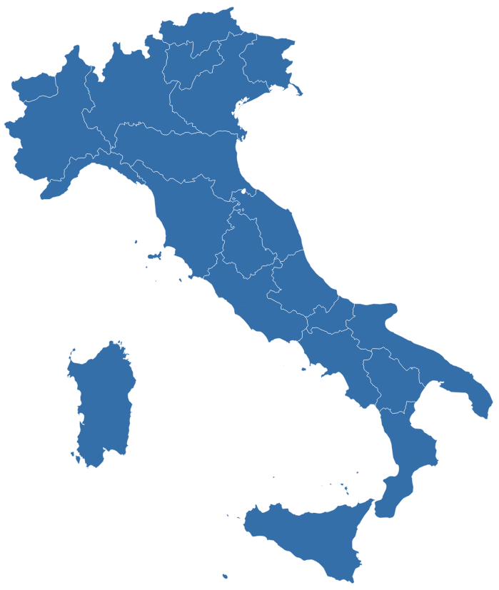

# Progetto HTML + CSS + JS

## Descrizione
Questo progetto mostra come integrare **HTML**, **CSS** e **JavaScript** per creare una **mappa interattiva dell’Italia**.  
Gli utenti possono cliccare o passare con il mouse sulle regioni per ottenere informazioni aggiuntive, rendendo la mappa uno strumento utile sia didattico che informativo.

---

## Struttura del progetto
```
.
├── index.html     # Pagina principale
├── stile.css      # File CSS esterno per la grafica
├── script.js      # File JavaScript esterno per l’interattività
└── screenshot.png # Immagine di esempio (sostituibile con uno screenshot reale)
```

---

## Come eseguirlo
1. Clona il repository:
   ```bash
   git clone https://github.com/tuo-username/nome-progetto.git
   ```
2. Entra nella cartella:
   ```bash
   cd nome-progetto
   ```
3. Apri `index.html` in un browser.

---

## Tecnologie utilizzate
- **HTML5** – struttura della pagina  
- **CSS3** – stili e layout  
- **JavaScript** – interattività  

---

## Screenshot
Esempio della pagina in esecuzione:

